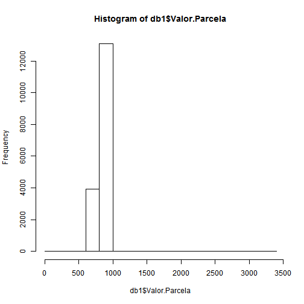
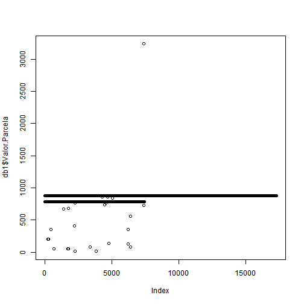

<style>
body {
    overflow: scroll;
}
</style>


Apresentacao
========================================================
author: Felipe Leitao Da Silva - 1520418
date: 21/09/2017
autosize: true

Quantidade de registros
========================================================

- Para obter a quantidade de registros, utilizei a rotina nrow, 
exemplo abaixo:


```r
setwd("C:/Users/Felipe/Desktop/Exercicios Big Data/")
db1 <- read.table('data_1.txt', header = TRUE, sep = "\t")

nrow(db1)
```

```
[1] 17300
```


Entender quais os campos estao disponiveis
========================================================

- Para entender quais os campos estao disponiveis, utilizei a rotina str, 
exemplo abaixo:


```r
setwd("C:/Users/Felipe/Desktop/Exercicios Big Data/")
db1 <- read.table('data_1.txt', header = TRUE, sep = "\t")

str(db1)
```

```
'data.frame':	17300 obs. of  26 variables:
 $ X0                            : int  1 1 1 1 1 1 1 1 1 1 ...
 $ Data.Referência               : Factor w/ 1 level "jan/16": 1 1 1 1 1 1 1 1 1 1 ...
 $ Número.Requerimento           : int  1723105371 1723105371 1723115077 1723115077 1723115077 1723115077 1723115785 1723115785 1723115785 1723115785 ...
 $ Data.Requerimento             : Factor w/ 302 levels "01/02/2010","01/09/2015",..: 192 192 223 223 223 223 223 223 223 223 ...
 $ PIS.Pescador                  : num  1.28e+10 1.28e+10 1.25e+10 1.25e+10 1.25e+10 ...
 $ CPF.Pescador                  : Factor w/ 9709 levels "***.000.00*-**",..: 5763 5763 5720 5720 5720 5720 9322 9322 9322 9322 ...
 $ Número.RGP                    : Factor w/ 10249 levels "1000000","100002",..: 4222 4222 2799 2799 2799 2799 8155 8155 8155 8155 ...
 $ Nome.Pescador                 : Factor w/ 10063 levels "ABDIAS GAMA DE ALMEIDA",..: 6069 6069 5908 5908 5908 5908 553 553 553 553 ...
 $ UF.Pescador                   : Factor w/ 25 levels "AL","AM","AP",..: 17 17 17 17 17 17 14 14 14 14 ...
 $ Código.IBGE.Município.Pescador: int  220570 220570 220570 220570 220570 220570 150178 150178 150178 150178 ...
 $ Nome.Município.Pescador       : Factor w/ 966 levels "Abadia dos Dourados",..: 523 523 523 523 523 523 111 111 111 111 ...
 $ Portaria.Defeso.IBAMA         : Factor w/ 98 levels "10/5-ESTADO DO RIO GRANDE DO NORTE",..: 49 49 49 49 49 49 7 7 7 7 ...
 $ Data.Início.Defeso            : Factor w/ 58 levels "01/01/2011","01/01/2015",..: 55 55 55 55 55 55 26 26 26 26 ...
 $ Data.Fim.Defeso               : Factor w/ 63 levels "14/02/2004","15/01/2015",..: 22 22 22 22 22 22 33 33 33 33 ...
 $ Data.Emissão.Parcela          : Factor w/ 119 levels "01/01/1900","01/02/2003",..: 118 118 118 118 118 118 68 68 68 68 ...
 $ Número.Parcela                : int  3 4 1 2 3 4 1 2 3 4 ...
 $ Data.Saque.Parcela            : Factor w/ 22 levels "","04/01/2016",..: 3 3 13 13 13 13 19 19 19 19 ...
 $ Valor.Parcela                 : num  788 788 788 788 788 788 880 880 880 880 ...
 $ Data.Restituição              : Factor w/ 20 levels "","04/01/2016",..: 1 1 1 1 1 1 1 1 1 1 ...
 $ Valor.Restituição             : num  NA NA NA NA NA NA NA NA NA NA ...
 $ Código.Situação.Parcela       : int  2 2 2 2 2 2 2 2 2 2 ...
 $ Descrição.Situação.Parcela    : Factor w/ 2 levels "Restituição",..: 2 2 2 2 2 2 2 2 2 2 ...
 $ CodigoFuncao                  : int  11 11 11 11 11 11 11 11 11 11 ...
 $ CodigoSubfuncao               : int  331 331 331 331 331 331 331 331 331 331 ...
 $ CodigoPrograma                : int  104 104 104 104 104 104 104 104 104 104 ...
 $ CodigoAcao                    : int  585 585 585 585 585 585 585 585 585 585 ...
```

Exibindo alguns registros
========================================================

- Para exibir os 5 primeiros registros utilizei a rotina head, 
exemplo abaixo:


```r
setwd("C:/Users/Felipe/Desktop/Exercicios Big Data/")
db1 <- read.table('data_1.txt', header = TRUE, sep = "\t")

head(db1, 5)
```

```
  X0 Data.Referência Número.Requerimento Data.Requerimento PIS.Pescador
1  1          jan/16          1723105371        19/12/2014  12814152485
2  1          jan/16          1723105371        19/12/2014  12814152485
3  1          jan/16          1723115077        22/12/2014  12487145228
4  1          jan/16          1723115077        22/12/2014  12487145228
5  1          jan/16          1723115077        22/12/2014  12487145228
    CPF.Pescador Número.RGP                      Nome.Pescador UF.Pescador
1 ***.582.80*-**     599807 MADREAHT DO CARMO MARTINS DA ROCHA          PI
2 ***.582.80*-**     599807 MADREAHT DO CARMO MARTINS DA ROCHA          PI
3 ***.579.19*-**     403285                  LUIS PINTO GALENO          PI
4 ***.579.19*-**     403285                  LUIS PINTO GALENO          PI
5 ***.579.19*-**     403285                  LUIS PINTO GALENO          PI
  Código.IBGE.Município.Pescador Nome.Município.Pescador
1                         220570            Luís Correia
2                         220570            Luís Correia
3                         220570            Luís Correia
4                         220570            Luís Correia
5                         220570            Luís Correia
                     Portaria.Defeso.IBAMA Data.Início.Defeso
1 40/10-BACIA HIDROGRAFICA DO RIO PARNAIBA         15/11/2014
2 40/10-BACIA HIDROGRAFICA DO RIO PARNAIBA         15/11/2014
3 40/10-BACIA HIDROGRAFICA DO RIO PARNAIBA         15/11/2014
4 40/10-BACIA HIDROGRAFICA DO RIO PARNAIBA         15/11/2014
5 40/10-BACIA HIDROGRAFICA DO RIO PARNAIBA         15/11/2014
  Data.Fim.Defeso Data.Emissão.Parcela Número.Parcela Data.Saque.Parcela
1      16/03/2015           30/12/2015              3         05/01/2016
2      16/03/2015           30/12/2015              4         05/01/2016
3      16/03/2015           30/12/2015              1         18/01/2016
4      16/03/2015           30/12/2015              2         18/01/2016
5      16/03/2015           30/12/2015              3         18/01/2016
  Valor.Parcela Data.Restituição Valor.Restituição Código.Situação.Parcela
1           788                                 NA                       2
2           788                                 NA                       2
3           788                                 NA                       2
4           788                                 NA                       2
5           788                                 NA                       2
  Descrição.Situação.Parcela CodigoFuncao CodigoSubfuncao CodigoPrograma
1                      Saque           11             331            104
2                      Saque           11             331            104
3                      Saque           11             331            104
4                      Saque           11             331            104
5                      Saque           11             331            104
  CodigoAcao
1        585
2        585
3        585
4        585
5        585
```


Analisando alguns registros
========================================================

- Para analisar os registros utilizei a rotina summary, 
exemplo abaixo:


```r
setwd("C:/Users/Felipe/Desktop/Exercicios Big Data/")
db1 <- read.table('data_1.txt', header = TRUE, sep = "\t")

summary(db1)
```

```
       X0    Data.Referência Número.Requerimento  Data.Requerimento
 Min.   :1   jan/16:17300    Min.   :1.002e+09   01/12/2015: 3380  
 1st Qu.:1                   1st Qu.:1.724e+09   04/12/2015:  721  
 Median :1                   Median :1.724e+09   09/12/2015:  681  
 Mean   :1                   Mean   :1.715e+09   07/12/2015:  559  
 3rd Qu.:1                   3rd Qu.:1.724e+09   19/11/2015:  446  
 Max.   :1                   Max.   :1.724e+09   30/12/2015:  443  
                                                 (Other)   :11070  
  PIS.Pescador               CPF.Pescador     Número.RGP   
 Min.   :1.002e+10   ***.381.98*-**:   16   380195 :   16  
 1st Qu.:1.275e+10   ***.289.94*-**:   14   242868 :   14  
 Median :1.610e+10   ***.847.48*-**:   14   189530 :   12  
 Mean   :1.563e+10   ***.261.00*-**:   13   20063  :   10  
 3rd Qu.:1.662e+10   ***.110.25*-**:   11   635837 :    9  
 Max.   :2.371e+10   ***.244.75*-**:   10   421950 :    8  
                     (Other)       :17222   (Other):17231  
                       Nome.Pescador    UF.Pescador  
 MARIA IZABEL PEREIRA DA SILVA:   16   PA     :4497  
 WELIO ALVES MESQUITA         :   14   SE     :2978  
 MARIA JOSE DOS SANTOS        :   12   BA     :2250  
 PAULO CESAR HOLANDA MAIA     :   12   MG     :1712  
 GLICERIA MELO DE SOUZA       :   10   SP     :1128  
 JOSE CARLOS DOS SANTOS       :   10   AL     : 547  
 (Other)                      :17226   (Other):4188  
 Código.IBGE.Município.Pescador      Nome.Município.Pescador
 Min.   :130060                 Limoeiro do Ajuru:  929     
 1st Qu.:150490                 Cametá           :  928     
 Median :280490                 Abaetetuba       :  611     
 Mean   :267931                 São Cristóvão    :  453     
 3rd Qu.:314350                 Mocajuba         :  424     
 Max.   :999999                 Aracaju          :  322     
                                (Other)          :13633     
                              Portaria.Defeso.IBAMA  Data.Início.Defeso
 13/9-BACIA DOS RIOS TOCANTINS E GURUPI  :3970      01/11/2015:10572   
 50/12-RIO SAO FRANCISCO MG.AL.SE.BA.PE.G:3176      01/12/2015: 2985   
 14/72-ESTADO DE AL E SE                 :2589      05/11/2015:  549   
 25/11-BACIA HIDROGRAFICA DO RIO PARANA  :2186      15/11/2014:  542   
 196/8-BH LESTE SE.BA.MG E ES EXC SAO FRA: 556      01/01/2015:  536   
 48/76-BACIA AMAZONICA ILHA DO MARAJÃ?Â? : 536      01/10/2015:  462   
 (Other)                                 :4287      (Other)   : 1654   
   Data.Fim.Defeso  Data.Emissão.Parcela Número.Parcela 
 28/02/2016:10857   14/01/2016:5358      Min.   :1.000  
 15/01/2016: 2941   21/01/2016:5177      1st Qu.:1.000  
 30/04/2015:  581   30/12/2015:2655      Median :1.000  
 31/01/2016:  499   09/01/2016:2503      Mean   :1.516  
 31/10/2015:  430   17/12/2015: 586      3rd Qu.:2.000  
 28/02/2015:  336   10/12/2015: 311      Max.   :6.000  
 (Other)   : 1656   (Other)   : 710                     
  Data.Saque.Parcela Valor.Parcela       Data.Restituição
 26/01/2016:3190     Min.   :  12.12             :17021  
 19/01/2016:2656     1st Qu.: 880.00   29/01/2016:  114  
 05/01/2016:1597     Median : 880.00   21/01/2016:   53  
 12/01/2016:1476     Mean   : 858.10   14/01/2016:   18  
 27/01/2016:1428     3rd Qu.: 880.00   27/01/2016:   15  
 20/01/2016:1196     Max.   :3238.03   15/01/2016:   12  
 (Other)   :5757     NA's   :279       (Other)   :   67  
 Valor.Restituição Código.Situação.Parcela Descrição.Situação.Parcela
 Min.   :-876.86   Min.   :2.000           Restituição:  279         
 1st Qu.:-742.38   1st Qu.:2.000           Saque      :17021         
 Median :-648.52   Median :2.000                                     
 Mean   :-566.88   Mean   :2.081                                     
 3rd Qu.:-425.19   3rd Qu.:2.000                                     
 Max.   :  -0.79   Max.   :7.000                                     
 NA's   :17021                                                       
  CodigoFuncao CodigoSubfuncao CodigoPrograma   CodigoAcao 
 Min.   :11    Min.   :331     Min.   :104    Min.   :585  
 1st Qu.:11    1st Qu.:331     1st Qu.:104    1st Qu.:585  
 Median :11    Median :331     Median :104    Median :585  
 Mean   :11    Mean   :331     Mean   :104    Mean   :585  
 3rd Qu.:11    3rd Qu.:331     3rd Qu.:104    3rd Qu.:585  
 Max.   :11    Max.   :331     Max.   :104    Max.   :585  
                                                           
```

Grafico Histograma
========================================================

- Para mostrar o histograma dos registros utilizei a rotina hist
exemplo abaixo:


```r
setwd("C:/Users/Felipe/Desktop/Exercicios Big Data/")
db1 <- read.table('data_1.txt', header = TRUE, sep = "\t")

hist(db1$Valor.Parcela)
```




Grafico de dispersao
========================================================

- Para mostrar o grafico de dispersao das parcelas utilizei a rotina hist
exemplo abaixo:


```r
setwd("C:/Users/Felipe/Desktop/Exercicios Big Data/")
db1 <- read.table('data_1.txt', header = TRUE, sep = "\t")

plot(db1$Valor.Parcela)
```


